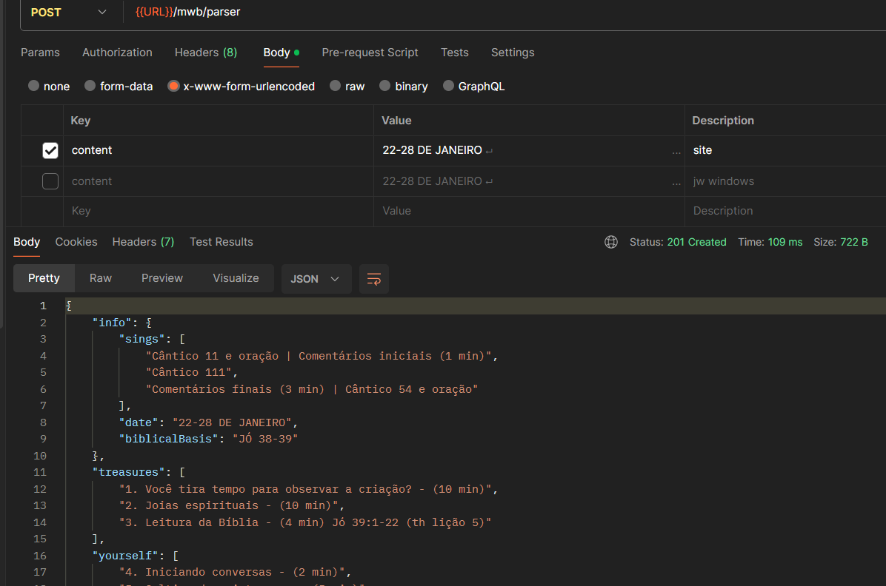

# JW Meeting Parser



```

## Build e Start

```sh
npm run build;
npm start
```

## Como usar?

> Faça uma requisição POST com o campo 'content' com o texto a seguir...

```http
POST /parser HTTP/1.1
Host: 127.0.0.1:3000
Content-Type: application/x-www-form-urlencoded
Content-Length: 2112

content="..."
```

## Resposta

```json
{
    "info": {
        "sings": [
            "Cântico 11 e oração | Comentários iniciais (1 min)",
            "Cântico 111",
            "Comentários finais (3 min) | Cântico 54 e oração"
        ],
        "date": "22-28 DE JANEIRO",
        "biblicalBasis": "JÓ 38-39"
    },
    "treasures": [
        "1. Você tira tempo para observar a criação? - (10 min)",
        "2. Joias espirituais - (10 min)",
        "3. Leitura da Bíblia - (4 min) Jó 39:1-22 (th lição 5)"
    ],
    "yourself": [
        "4. Iniciando conversas - (2 min)",
        "5. Cultivando o interesse - (5 min)",
        "6. Discurso - (5 min)"
    ]
}
```

### Content modelo

```txt
22-28 DE JANEIRO
JÓ 38-39
Cântico 11 e oração | Comentários iniciais (1 min)
TESOUROS DA PALAVRA DE DEUS
1. Você tira tempo para observar a criação?
(10 min)
Depois de criar a Terra, Jeová tirou tempo para refletir em tudo o que tinha feito. (Gên. 1:10, 12; Jó 38:5, 6; w21.08 9 § 7)
Os anjos tiraram tempo para observar a criação de Jeová. (Jó 38:7; w20.08 14 § 2)
Quando tiramos tempo para observar e apreciar a criação, nossa confiança em Jeová fica mais forte. (Jó 38:32-35; w23.03 17 § 8)
2. Joias espirituais
(10 min)
Jó 38:8-10 — O que esses versículos nos ensinam sobre o papel de Jeová como Legislador? (it-2 199)
Sua resposta
Que joias espirituais você encontrou na leitura da Bíblia desta semana?
Sua resposta
3. Leitura da Bíblia
(4 min) Jó 39:1-22 (th lição 5)
FAÇA SEU MELHOR NO MINISTÉRIO
4. Iniciando conversas
(2 min) TESTEMUNHO INFORMAL. Termine a conversa de uma forma bondosa ao perceber que a pessoa não quer conversar. (lmd lição 2 ponto 3)
5. Cultivando o interesse
(5 min) DE CASA EM CASA. Numa conversa anterior, a pessoa contou para você que perdeu alguém querido recentemente. (lmd lição 9 ponto 3)
6. Discurso
(5 min) lmd apêndice A ponto 1 — Tema: Os acontecimentos mundiais e a atitude das pessoas indicam que uma mudança está próxima. (th lição 16)
NOSSA VIDA CRISTÃ
Cântico 111
7. Observar a criação nos ajuda a não nos concentrar em nós mesmos
(15 min) Consideração.
Quando Jó estava sendo atacado por seus três companheiros e por Satanás, ele só se concentrou nos seus problemas e nas coisas injustas que falavam sobre ele.
Leia Jó 37:14. Depois, pergunte:
O que Jó precisou fazer para voltar a pensar de modo espiritual?
Sua resposta
Quando os problemas estão nos sufocando, podemos observar a criação. Isso vai nos ajudar a lembrar do poder de Jeová, fortalecer nossa vontade de continuar leais a ele e aumentar nossa confiança de que ele vai cuidar de nós. — Mat. 6:26.
Mostre o VÍDEO O Que o Livro de Jó nos Ensina — Animais. Depois, pergunte:
Como esse vídeo fortaleceu sua confiança em Jeová?
Sua resposta
8. Estudo bíblico de congregação
(30 min) bt cap. 4 §§ 13-20
Comentários finais (3 min) | Cântico 54 e oração
```